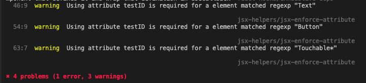

# eslint-plugin-jsx-helpers

## About

The bunch of rules which help lint react/react-native JSX elements

## Using

1. Install the package following one of the ways (depends on you preferred package manager):

```
npm i -D eslint-plugin-jsx-helpers
```

```
yarn add --dev -D eslint-plugin-jsx-helpers
```

```
pnpm i -D eslint-plugin-jsx-helpers
```

2. Include plugin name to the plugins list within your eslint config.

```
// .eslintrc.js
module.exports = {
  plugins: ['jsx-helpers'],
};
```

# Rules

## jsx-helpers/jsx-enforce-attribute

### About

Helps to ensure that some JSX element has certain attribute.

For example you can use it to require having test id attribute like _data-test-id_ (for React) or _testID_ (for React Native).

### Using

The rule requires pointing out additional options:

- _attributeName_ - the name of the attribute
- _elementMatchers_ - the array of RegExp matchers to determine which

```
// .eslintrc.js
module.exports = {
  plugins: ['jsx-helpers'],
  rules: {
    'jsx-helpers/jsx-enforce-attribute': [
      'warn',
      {
        attributeName: 'testID',
        elementMatchers: ['Text', 'Touchable*', 'Button', 'Image'],
      },
    ],
  },
};
```

## Showcases



